# Diagramas de Flujo - Sistema de Reservas

Este documento contiene diagramas visuales del flujo de reservas usando Mermaid.

> **Nota:** Estos diagramas se renderizan automáticamente en GitHub, GitLab, y muchos editores de Markdown.

---

## 📊 Diagrama Principal de Estados

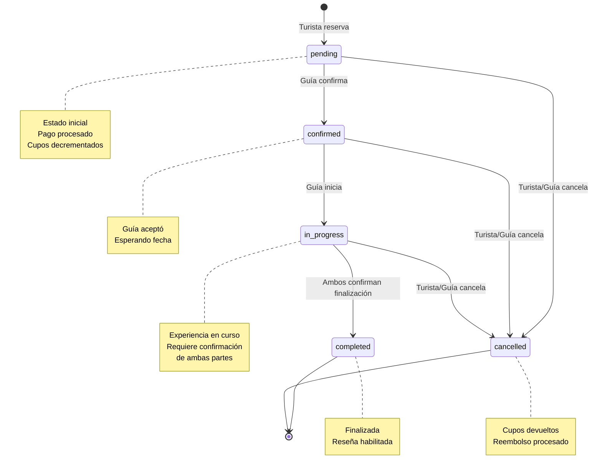

---

## 🔄 Flujo de Creación de Reserva

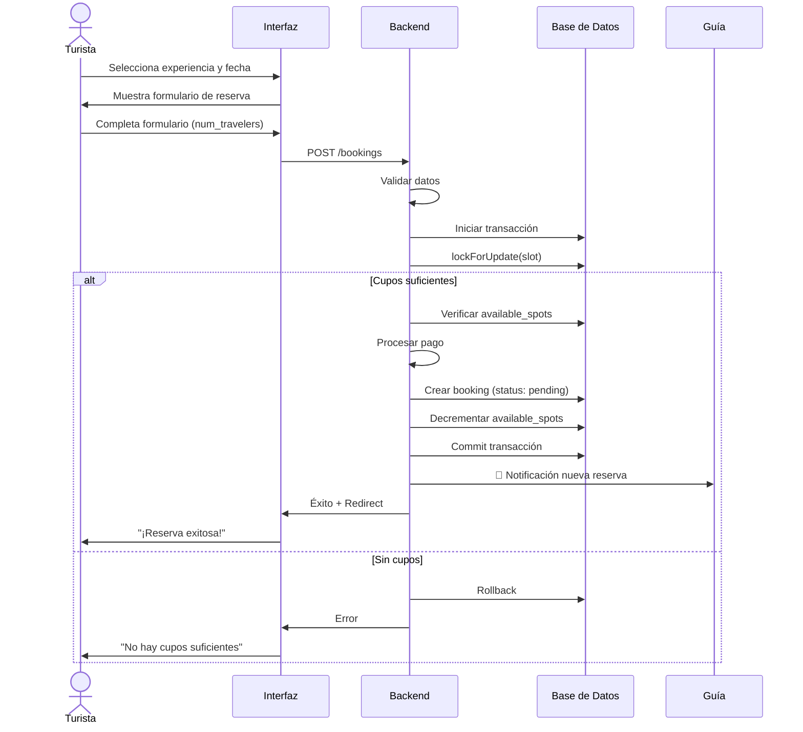

---

## ✅ Flujo de Confirmación por el Guía

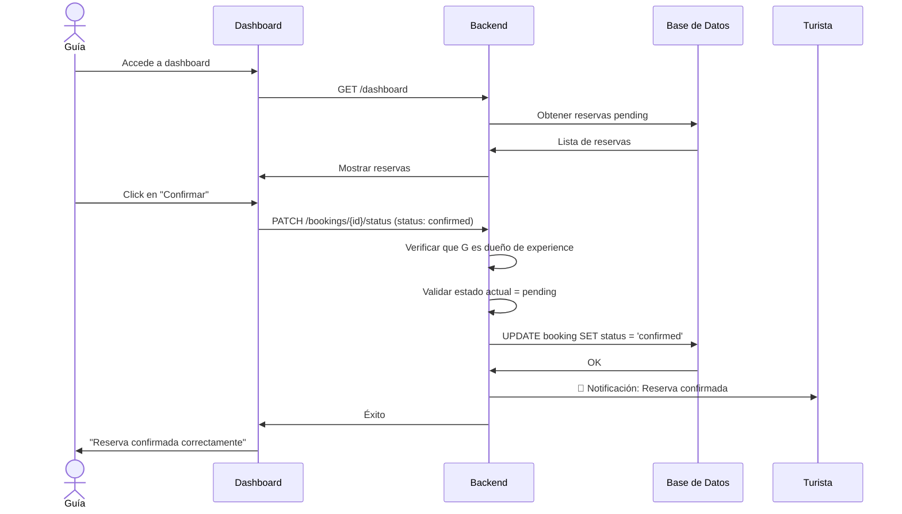

---

## 🎯 Flujo de Completar Experiencia (Dos Pasos)

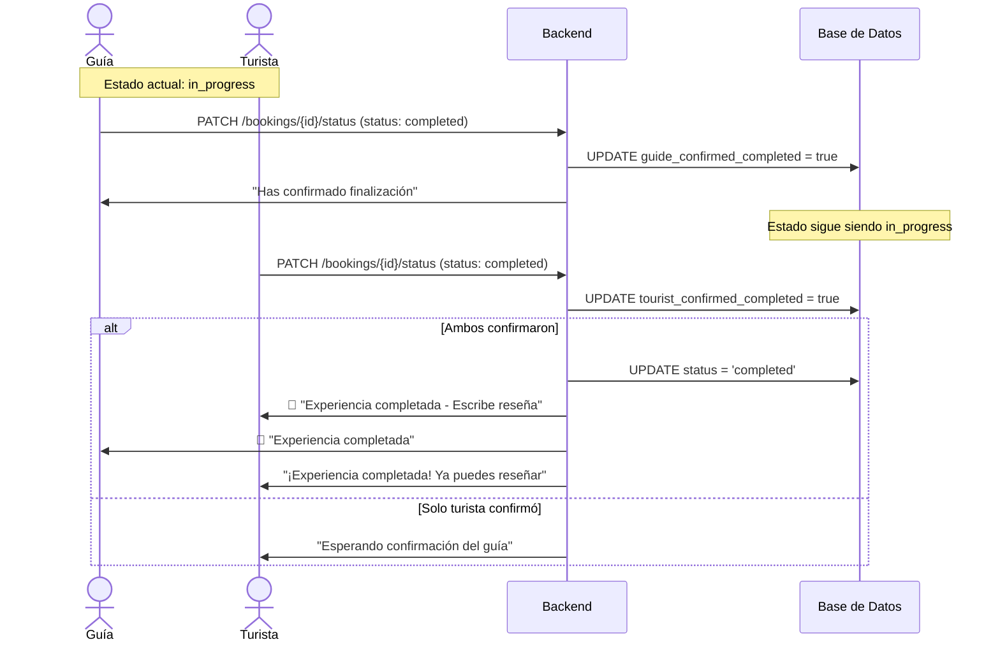

---

## ❌ Flujo de Cancelación

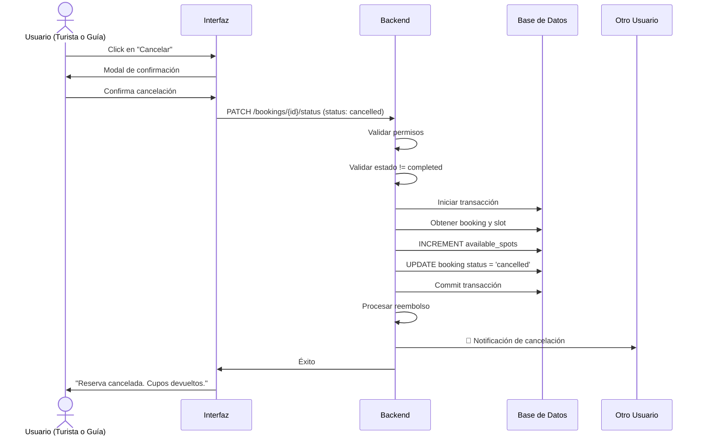

---

## 🔐 Diagrama de Permisos

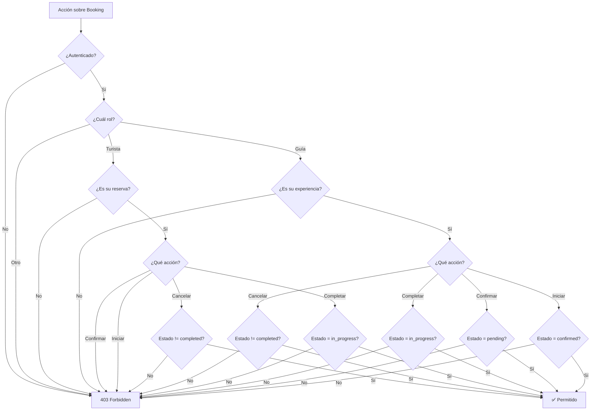

---

## 🏗️ Arquitectura de Componentes

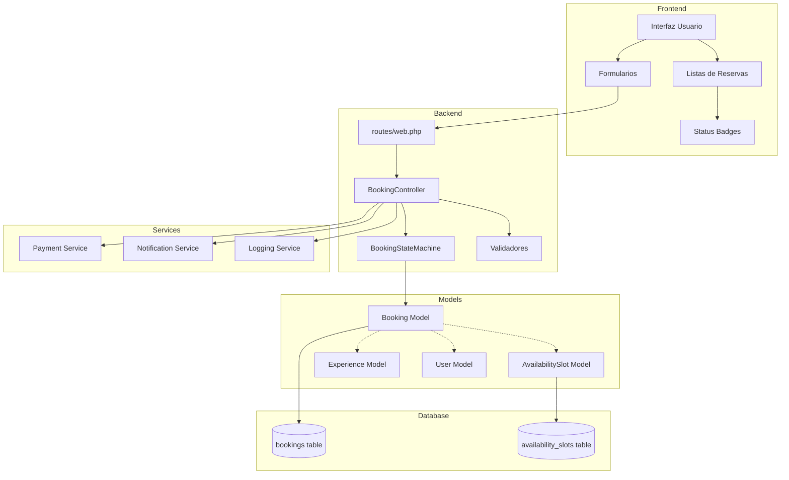

---

## 📱 Flujo de Usuario Turista Completo

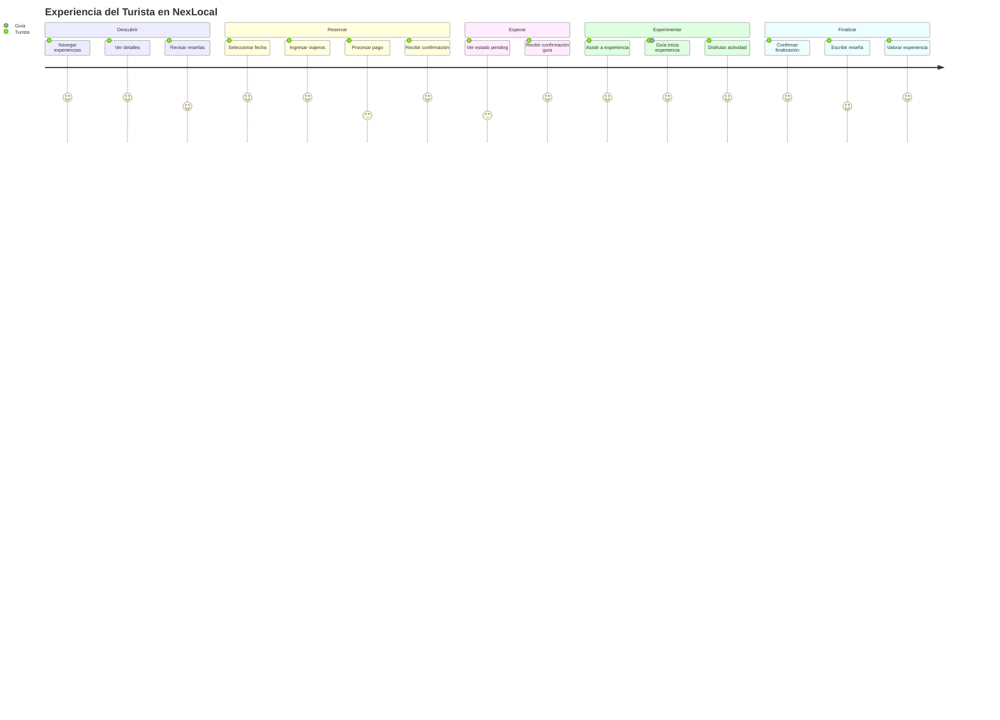

---

## 🎯 Flujo de Usuario Guía Completo

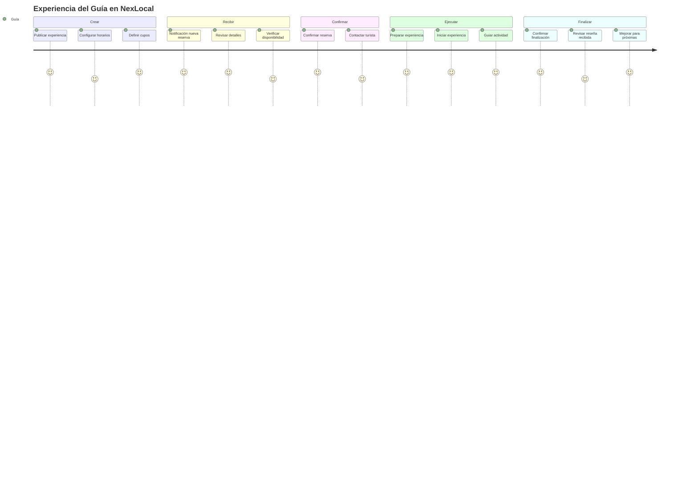

---

## 🔍 Flujo de Validación de Cupos

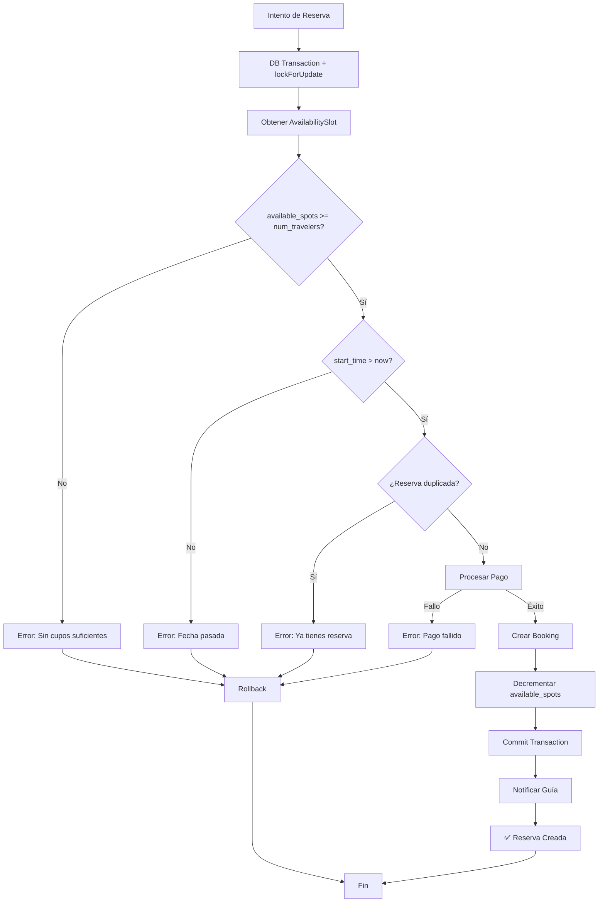

---

## 📊 Timeline de una Reserva Típica

```mermaid
gantt
    title Timeline de Reserva - Tour por el Río Sinú
    dateFormat YYYY-MM-DD HH:mm
    axisFormat %d/%m %H:%M
    
    section Turista
    Navega y selecciona :done, t1, 2025-11-16 10:00, 30m
    Completa reserva :done, t2, after t1, 10m
    Espera confirmación :active, t3, after t2, 12h
    Asiste a experiencia :milestone, t4, 2025-11-18 09:00, 0m
    Confirma finalización :crit, t5, 2025-11-18 13:00, 5m
    Escribe reseña :t6, after t5, 1h
    
    section Guía
    Recibe notificación :done, g1, 2025-11-16 10:10, 1m
    Revisa reserva :g2, after g1, 30m
    Confirma reserva :milestone, g3, 2025-11-16 14:00, 0m
    Prepara experiencia :g4, 2025-11-18 08:00, 1h
    Inicia experiencia :milestone, g5, 2025-11-18 09:00, 0m
    Guía actividad :g6, after g5, 4h
    Confirma finalización :crit, g7, 2025-11-18 13:05, 5m
    
    section Sistema
    Status: pending :active, s1, 2025-11-16 10:10, 4h
    Status: confirmed :active, s2, 2025-11-16 14:00, 43h
    Status: in_progress :active, s3, 2025-11-18 09:00, 4h
    Status: completed :done, s4, 2025-11-18 13:05, 0m
```

---

## 🔄 Ciclo de Vida Completo

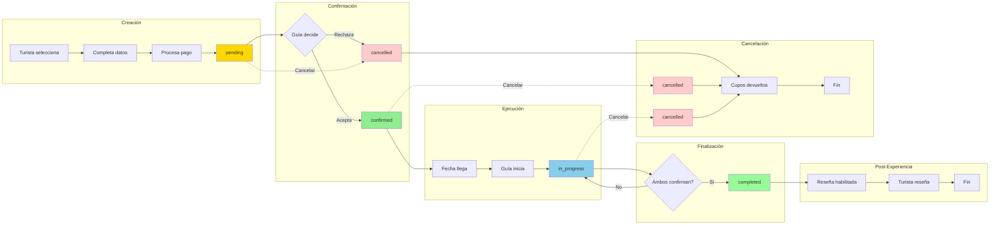

---

## 📝 Cómo Usar Estos Diagramas

### Visualización
- **GitHub/GitLab**: Se renderizan automáticamente
- **VS Code**: Instalar extensión "Markdown Preview Mermaid Support"
- **Editor online**: https://mermaid.live/

### Exportar
Para exportar a imagen:
1. Visitar https://mermaid.live/
2. Pegar el código del diagrama
3. Click en "Actions" > "PNG" o "SVG"

### Personalizar
Puedes modificar estos diagramas según tus necesidades editando el código Mermaid.

---

**Última actualización:** Noviembre 2025  
**Documentación:** [Ver README principal](./README.md)

