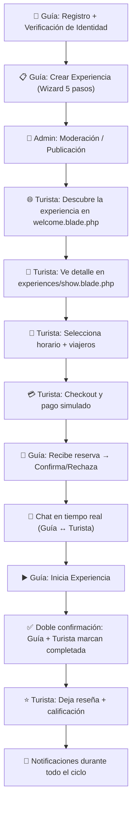
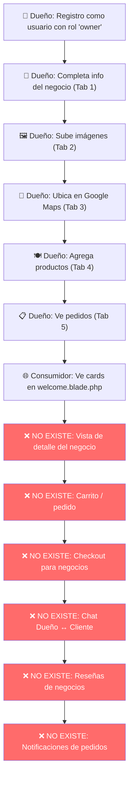
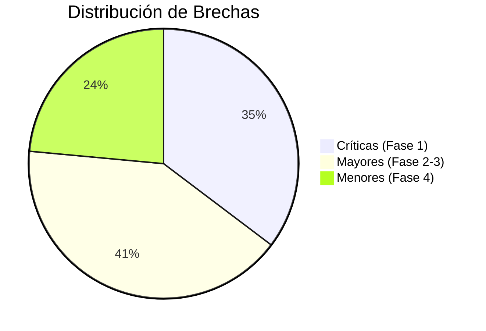

# NexLocal — Análisis Comparativo de UX y Plan de Implementación

## Flujo A: Experiencias (Guía ↔ Turista) vs. Flujo B: Descubre tu Ciudad (Dueño ↔ Consumidor)

---

## 1. Mapeo Completo de Etapas — Flujo de Experiencias (Guía)



### Detalle de lo que existe hoy (Frontend implementado):

| Etapa | Vista/Componente | Estado |
|---|---|---|
| Verificación de identidad | `verification/create.blade.php` | ✅ Completo |
| Crear experiencia | `experiences/create.blade.php` (Wizard 5 pasos con Alpine.js) | ✅ Completo |
| Editar experiencia | `experiences/edit.blade.php` | ✅ Completo |
| Listado público | `welcome.blade.php` (cards + filtros por categoría con Alpine) | ✅ Completo |
| Detalle de experiencia | `experiences/show.blade.php` (imagen, mapa, incluye/no incluye, reseñas, perfil del guía) | ✅ Completo |
| Reserva + selección de horario | `experiences/show.blade.php` (sidebar con slots) | ✅ Completo |
| Checkout y pago | `bookings/checkout.blade.php` (pasarela simulada con validación JS) | ✅ Completo |
| Confirmación de pago | `bookings/success.blade.php` | ✅ Completo |
| Dashboard del guía | `dashboard/guide.blade.php` (KPIs, tabla de reservas, filtros, modales de detalle) | ✅ Completo |
| Gestión de reservas | Tabla con estados: pending → confirmed → in_progress → completed/cancelled | ✅ Completo |
| Chat en tiempo real | `components/chat-windows.blade.php` (bidireccional por booking) | ✅ Completo |
| Mis Reservas (turista) | `bookings/index.blade.php` (cards con acciones por estado) | ✅ Completo |
| Reseñas | `reviews/create.blade.php` (star rating + comentario) | ✅ Completo |
| Notificaciones | `notifications/index.blade.php` (listado + badge de no leídas) | ✅ Completo |
| Panel de Admin | `admin/` (moderación de experiencias, verificación, usuarios, reseñas, auditoría) | ✅ Completo |

---

## 2. Mapeo Completo de Etapas — Flujo de "Descubre tu Ciudad" (Dueño)



### Detalle de lo que existe hoy:

| Etapa | Vista/Componente | Estado |
|---|---|---|
| Dashboard del dueño | `dashboard/owner.blade.php` (5 tabs con Alpine.js) | ✅ Completo |
| Info general del negocio | Tab 1: Formulario con tipo, categoría, servicios, capacidad | ✅ Completo |
| Gestión de imágenes | Tab 2: Cover + galería con upload y eliminación | ✅ Completo |
| Contacto y ubicación | Tab 3: Google Maps + dirección + teléfono + email | ✅ Completo |
| Catálogo de productos | Tab 4: Grid de cards + modal de creación | ✅ Completo |
| Tabla de pedidos | Tab 5: KPIs + tabla de órdenes con estados | ⚠️ Parcial (sin acciones reales) |
| Card pública del negocio | `components/restaurant-card.blade.php` | ✅ Completo |
| Listado en welcome.blade.php | Sección "Descubre tu ciudad" con filtros por categoría | ✅ Completo |
| **Vista de detalle del negocio** | **NO EXISTE** | ❌ Faltante |
| **Carrito de compras** | **NO EXISTE** | ❌ Faltante |
| **Checkout / pago para pedidos** | **NO EXISTE** | ❌ Faltante |
| **Sistema de pedidos (consumidor)** | **NO EXISTE** | ❌ Faltante |
| **Chat Dueño ↔ Cliente** | **NO EXISTE** | ❌ Faltante |
| **Reseñas de negocios** | **NO EXISTE** | ❌ Faltante |
| **Notificaciones de pedidos** | **NO EXISTE** | ❌ Faltante |
| **"Mis Pedidos" del consumidor** | **NO EXISTE** | ❌ Faltante |

---

## 3. Tabla de Paridad de Características

| Característica | Experiencias (Guía) | Descubre tu Ciudad (Dueño) | Brecha |
|---|:---:|:---:|---|
| **Onboarding del proveedor** | ✅ Verificación de identidad | ⚠️ Solo registro | El dueño no pasa por verificación ni moderación |
| **Creación de oferta** | ✅ Wizard 5 pasos premium | ✅ Dashboard 5 tabs | Paridad funcional |
| **Listado público** | ✅ Cards + filtros Alpine | ✅ Cards + filtros Alpine | Paridad funcional |
| **Vista detalle pública** | ✅ `show.blade.php` completa (imagen, mapa, reseñas, sidebar de reserva) | ❌ No existe | **Brecha crítica** |
| **Selección de servicio** | ✅ Slots de horario + viajeros | ❌ No hay selección de productos/carrito | **Brecha crítica** |
| **Checkout / Pago** | ✅ Pasarela simulada completa | ❌ No existe | **Brecha crítica** |
| **Confirmación post-pago** | ✅ `success.blade.php` | ❌ No existe | **Brecha crítica** |
| **Gestión de pedidos (proveedor)** | ✅ Tabla con acciones por estado | ⚠️ Tabla solo lectura, sin acciones | **Brecha mayor** |
| **Seguimiento del cliente** | ✅ `bookings/index.blade.php` | ❌ No existe "Mis Pedidos" | **Brecha crítica** |
| **Chat bidireccional** | ✅ Chat en tiempo real por booking | ❌ No existe | **Brecha mayor** |
| **Reseñas y calificaciones** | ✅ Star rating + comentarios | ❌ No existe para negocios | **Brecha mayor** |
| **Notificaciones** | ✅ Sistema completo con badges | ❌ No integradas para pedidos | **Brecha mayor** |
| **Perfil público del proveedor** | ✅ Modal con bio, hobbies, foto | ❌ No existe perfil público del dueño | **Brecha menor** |
| **Panel de Admin** | ✅ Moderación, toggle featured, auditoría | ❌ No modera negocios | **Brecha menor** |
| **Doble confirmación** | ✅ Guía + Turista marcan completada | ❌ No existe workflow de entrega | **Brecha mayor** |

---

## 4. Plan de Implementación — Priorizado por Fases

### Fase 0: Rediseño del Panel del Dueño como E-Commerce Profesional (Fundacional)
> **Objetivo:** Transformar el dashboard monolítico (`owner.blade.php` — 705 líneas) en un sistema modular por componentes Blade, con personalización de tienda y herramientas de e-commerce reales para emprendedores.

#### 0.A — Arquitectura por Componentes Blade

El archivo `owner.blade.php` actual tiene **toda la lógica en un solo archivo de 705 líneas**. Se debe descomponer en componentes reutilizables:

```
resources/views/
├── dashboard/
│   └── owner.blade.php              ← Shell principal (tabs + layout)
├── components/owner/
│   ├── stats-overview.blade.php      ← KPIs: ventas, productos, rating, visitas
│   ├── business-form.blade.php       ← Tab 1: Info general del negocio
│   ├── image-manager.blade.php       ← Tab 2: Cover + galería drag & drop
│   ├── location-form.blade.php       ← Tab 3: Mapa + contacto
│   ├── product-grid.blade.php        ← Tab 4: Grid de productos
│   ├── product-card.blade.php        ← Card individual de producto (editable)
│   ├── product-modal.blade.php       ← Modal crear/editar producto
│   ├── order-table.blade.php         ← Tab 5: Tabla de pedidos con acciones
│   ├── order-detail-modal.blade.php  ← Modal detalle del pedido
│   └── store-customizer.blade.php    ← NUEVO: Personalización de la tienda
```

#### 0.B — Personalización de Tienda (Store Customizer)

El dueño debe poder personalizar cómo se ve su negocio en la vista pública, como lo haría en Shopify o MercadoShops:

| # | Feature | Descripción | Complejidad |
|---|---|---|---|
| 0.1 | **Banner personalizado** | El dueño elige un banner hero para su página pública (distinto al cover) | 🟢 Baja |
| 0.2 | **Colores y tema** | Selector de color primario/acento para su tienda pública (guardado en JSON) | 🟡 Media |
| 0.3 | **Redes sociales** | Links a Instagram, Facebook, WhatsApp, TikTok | 🟢 Baja |
| 0.4 | **Horarios de atención** | Editor visual de lunes a domingo con horarios de apertura/cierre | 🟡 Media |
| 0.5 | **Categorías de productos** | El dueño agrupa productos en categorías internas (Entradas, Platos Fuertes, Bebidas, etc.) | 🟡 Media |
| 0.6 | **Productos destacados** | Toggle "destacar" en cada producto para que aparezcan primero | 🟢 Baja |
| 0.7 | **Mensaje de bienvenida** | Texto corto que se muestra al entrar a la tienda pública | 🟢 Baja |
| 0.8 | **Métodos de pago aceptados** | Checkboxes: Efectivo, Nequi, Daviplata, Tarjeta, Transferencia | 🟢 Baja |

#### 0.C — Mejoras del Dashboard Actual

| # | Tarea | Descripción | Complejidad |
|---|---|---|---|
| 0.9 | **Stats Overview premium** | 4 KPI cards con íconos animados: Ingresos del mes, Pedidos hoy, Calificación promedio, Productos activos | 🟡 Media |
| 0.10 | **Drag & Drop en galería** | Reordenar imágenes de la galería arrastrando (con SortableJS) | 🟡 Media |
| 0.11 | **Product Card mejorada** | Toggle disponible/agotado, badge "Nuevo", badge "Destacado", edición inline del precio | 🟡 Media |
| 0.12 | **Categorías en productos** | Select de categoría en el modal de producto + filtro en el grid | 🟢 Baja |
| 0.13 | **Vista previa de la tienda** | Botón "Ver mi tienda como cliente" que abre `businesses/show` en nueva pestaña | 🟢 Baja |
| 0.14 | **Acciones masivas en pedidos** | Checkboxes + botón "Confirmar seleccionados" / "Exportar a CSV" | 🟡 Media |

#### 0.D — Migraciones Necesarias

```php
// add_store_customization_to_local_businesses_table
$table->string('banner_image_path')->nullable();
$table->json('theme_colors')->nullable();        // {"primary": "#7c3aed", "accent": "#f59e0b"}
$table->json('social_links')->nullable();         // {"instagram": "...", "whatsapp": "..."}
$table->json('operating_hours')->nullable();       // {"lunes": {"open": "08:00", "close": "18:00"}, ...}
$table->json('payment_methods')->nullable();       // ["efectivo", "nequi", "daviplata"]
$table->string('welcome_message')->nullable();

// add_ecommerce_fields_to_products_table
$table->string('product_category')->nullable();
$table->boolean('is_available')->default(true);
$table->boolean('is_featured')->default(false);
$table->integer('sort_order')->default(0);
```

### Fase 1: Experiencia del Consumidor (Crítico)
> **Objetivo:** Que un turista/consumidor pueda ver un negocio, agregar productos al carrito, y realizar un pedido.

| # | Tarea | Archivos a Crear/Modificar | Complejidad |
|---|---|---|---|
| 1.1 | **Vista de Detalle del Negocio** (`businesses/show.blade.php`) — Imagen hero, galería, descripción, mapa, servicios, productos con precios, reseñas, sidebar de "Hacer Pedido" | `resources/views/businesses/show.blade.php` (NUEVO), `routes/web.php`, `ExperienceController` o nuevo `BusinessController@show` | 🔴 Alta |
| 1.2 | **Carrito de Compras** (Alpine.js en localStorage) — Componente flotante tipo drawer, selección de productos con cantidades, subtotal en tiempo real | `resources/views/components/cart-drawer.blade.php` (NUEVO), JS integrado en `show.blade.php` | 🟡 Media |
| 1.3 | **Checkout para Pedidos** (`orders/checkout.blade.php`) — Resumen del pedido, datos de contacto del cliente, dirección de entrega (si aplica), pasarela simulada | `resources/views/orders/checkout.blade.php` (NUEVO), `app/Http/Controllers/OrderController.php` (NUEVO), `routes/web.php` | 🔴 Alta |
| 1.4 | **Confirmación de Pedido** (`orders/success.blade.php`) — Resumen post-pago con número de orden y estado | `resources/views/orders/success.blade.php` (NUEVO) | 🟢 Baja |
| 1.5 | **"Mis Pedidos" del Consumidor** (`orders/index.blade.php`) — Historial de pedidos con estados, similar a `bookings/index.blade.php` | `resources/views/orders/index.blade.php` (NUEVO), `OrderController@index` | 🟡 Media |
| 1.6 | **Link en la Restaurant Card** — Hacer la card clicable para ir a `businesses/show` | `resources/views/components/restaurant-card.blade.php` | 🟢 Baja |

### Fase 2: Gestión del Dueño (Mayor)
> **Objetivo:** Que el dueño pueda gestionar pedidos entrantes con un flujo de estados completo.

| # | Tarea | Archivos a Crear/Modificar | Complejidad |
|---|---|---|---|
| 2.1 | **Acciones en la Tabla de Pedidos** — Botones "Confirmar", "En Preparación", "Listo", "Entregado", "Rechazar" con cambio de estado real via POST | `resources/views/dashboard/owner.blade.php` (Tab 5), `OrderController@updateStatus` | 🟡 Media |
| 2.2 | **Modal de Detalle de Pedido** — Desglose de ítems, datos del cliente, dirección, total, timeline de estados | `resources/views/dashboard/owner.blade.php` (componente modal) | 🟡 Media |
| 2.3 | **Editar y Eliminar Productos (conectado)** — Los botones "Editar" y "Eliminar" en Tab 4 ya existen visualmente pero llaman `editProduct()` y `deleteProduct()` que son stubs JS. Conectar con rutas reales `PUT` y `DELETE` | `resources/views/dashboard/owner.blade.php`, `ProductController@update/destroy` | 🟡 Media |
| 2.4 | **KPIs Dinámicos del Dueño** — Agregar cards de resumen (ingresos totales, calificación promedio, productos activos) al inicio del dashboard, similar a las 3 KPI cards del guía | `resources/views/dashboard/owner.blade.php`, `DashboardController` | 🟢 Baja |

### Fase 3: Comunicación y Confianza (Mayor)
> **Objetivo:** Igualar los mecanismos de comunicación y feedback del flujo de experiencias.

| # | Tarea | Archivos a Crear/Modificar | Complejidad |
|---|---|---|---|
| 3.1 | **Chat Dueño ↔ Cliente** — Reutilizar el componente `chat-windows.blade.php` existente, adaptando la lógica para vincularse a `Order` en lugar de `Booking` | `ChatController`, `Order` model (relación de mensajes), `chat-windows.blade.php` | 🔴 Alta |
| 3.2 | **Reseñas para Negocios** — Modelo `BusinessReview`, formulario post-entrega, listado en la vista de detalle del negocio | `app/Models/BusinessReview.php` (NUEVO), migración, `BusinessReviewController` (NUEVO), `resources/views/businesses/show.blade.php` | 🟡 Media |
| 3.3 | **Notificaciones de Pedidos** — Nuevo pedido → notifica al dueño; Cambio de estado → notifica al cliente. Reutilizar `NotificationController` existente | `app/Notifications/` (NUEVAS clases), `OrderController` (dispatch events) | 🟡 Media |

### Fase 4: Moderación y Calidad (Menor)
> **Objetivo:** Dar al administrador control sobre los negocios publicados.

| # | Tarea | Archivos a Crear/Modificar | Complejidad |
|---|---|---|---|
| 4.1 | **Moderación de Negocios en Admin** — Aprobar/Ocultar negocios, toggle destacado | `resources/views/admin/businesses.blade.php` (NUEVO), `AdminController` | 🟡 Media |
| 4.2 | **Verificación del Dueño** — Proceso similar al guía (documentos de negocio, RUT/NIT) | Reutilizar flujo de `VerificationController` | 🟡 Media |
| 4.3 | **Horarios de Atención** — Campo estructurado para que el dueño defina días y horas de apertura/cierre | Migración + campo en `owner.blade.php` Tab 1 | 🟡 Media |
| 4.4 | **Disponibilidad de Productos** — Toggle de "Disponible/Agotado" por producto | `Product` model, `owner.blade.php` Tab 4, `ProductController` | 🟢 Baja |

---

## 5. Resumen de Brechas por Prioridad



> [!IMPORTANT]
> Las **6 brechas críticas** de la Fase 1 son las que impiden que el flujo del consumidor funcione de principio a fin. Sin ellas, la sección "Descubre tu Ciudad" es solo un escaparate visual sin transacción posible.

> [!TIP]
> **Reutilización clave:** El 60% de la infraestructura necesaria ya existe en el flujo de Experiencias. Los componentes de chat, notificaciones, checkout, y la estructura de cards/tablas se pueden adaptar directamente, reduciendo significativamente el tiempo de desarrollo.

---

## 6. Archivos Nuevos Necesarios (Resumen)

### Vistas (Blade)
```
resources/views/
├── businesses/
│   └── show.blade.php          ← Vista detalle del negocio (Fase 1.1)
├── orders/
│   ├── checkout.blade.php      ← Checkout de pedidos (Fase 1.3)
│   ├── success.blade.php       ← Confirmación post-pago (Fase 1.4)
│   └── index.blade.php         ← "Mis Pedidos" del consumidor (Fase 1.5)
├── components/
│   └── cart-drawer.blade.php   ← Carrito flotante (Fase 1.2)
└── admin/
    └── businesses.blade.php    ← Moderación de negocios (Fase 4.1)
```

### Controladores
```
app/Http/Controllers/
├── BusinessController.php      ← show(), (Fase 1.1)
├── OrderController.php         ← store(), index(), checkout(), updateStatus() (Fases 1.3-2.1)
└── BusinessReviewController.php ← store(), (Fase 3.2)
```

### Modelos y Migraciones
```
app/Models/
├── BusinessReview.php          ← Reseñas de negocios (Fase 3.2)

database/migrations/
├── create_business_reviews_table.php
├── add_operating_hours_to_local_businesses_table.php  (Fase 4.3)
├── add_is_available_to_products_table.php              (Fase 4.4)
```

---

## 7. Estimación de Esfuerzo

| Fase | Tareas | Complejidad Agregada | Estimación |
|---|:---:|---|---|
| Fase 0 | 14 | 🟡🟡🟡🟡🟡🟡🟢🟢🟢🟢🟢🟢🟢🟢 | **4-6 días** |
| Fase 1 | 6 | 🔴🔴🟡🟡🟢🟢 | **3-5 días** |
| Fase 2 | 4 | 🟡🟡🟡🟢 | **2-3 días** |
| Fase 3 | 3 | 🔴🟡🟡 | **2-4 días** |
| Fase 4 | 4 | 🟡🟡🟡🟢 | **2-3 días** |
| **Total** | **31** | | **13-21 días** |

> [!NOTE]
> Las estimaciones asumen reutilización activa de componentes existentes (checkout, chat, notificaciones) y un solo desarrollador.
